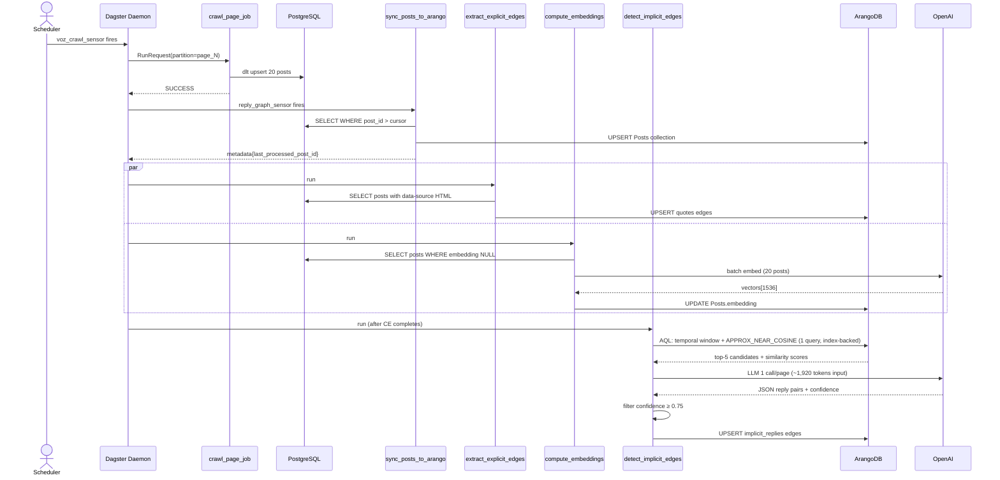
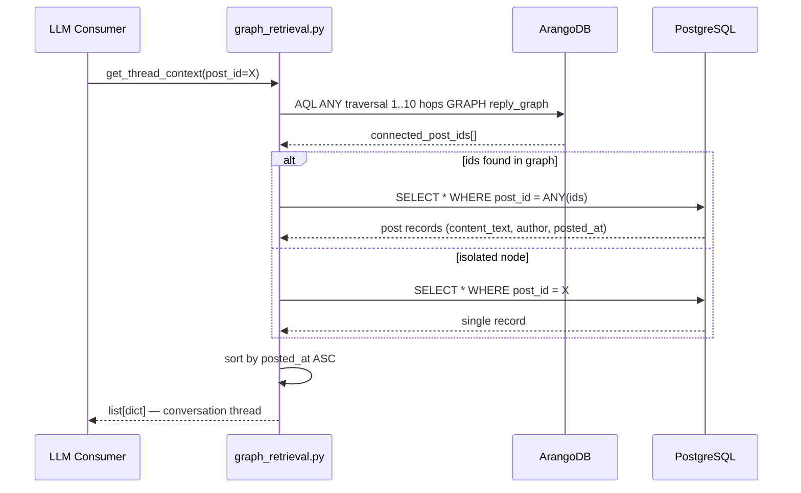
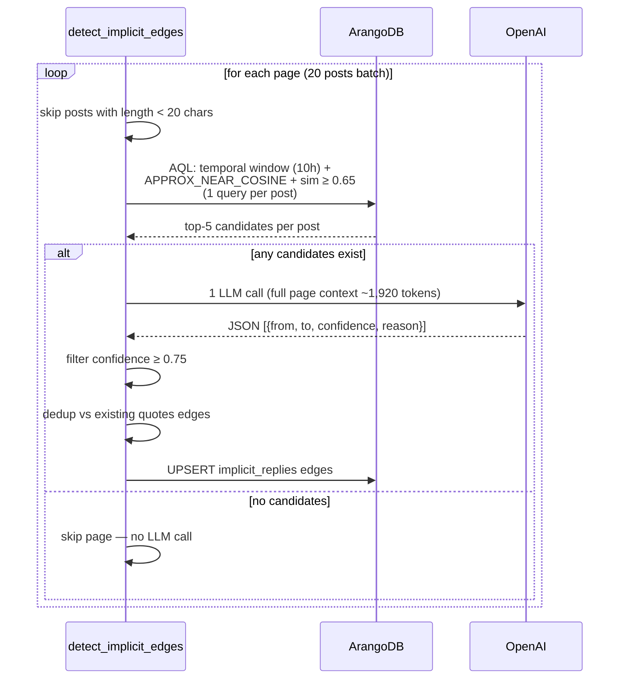

# Reply Graph Pipeline — Design Document

## 1. Objective

Build a relationship graph between posts in a Voz thread to provide conversational context for an LLM. The primary goal is to extract IT company information (abbreviations, inconsistent aliases across posts) by grouping related posts into the same conversation thread.

---

## 2. Graph Service: ArangoDB

| Criterion | Reason for choosing ArangoDB |
|---|---|
| Multi-model | Stores post documents + graph edges in the same service |
| Vector index | Native FAISS-based ANN search from v3.12.5 CE |
| BM25 | ArangoSearch built-in |
| Graph traversal | AQL with `ANY` direction, variable-depth |
| Incremental upsert | Native `UPSERT`, idempotent |

**Requirement**: ArangoDB ≥ 3.12.5 (Community Edition — vector index available).

---

## 3. Data Model

### 3.1 Vertex Collection: `Posts`

```json
{
  "_key": "21997699",
  "post_id": 21997699,
  "author_username": "Vipluckystar",
  "author_id": "660304",
  "posted_at": "2022-12-04T14:48:27Z",
  "content_text": "The old thread is too long and diluted...",
  "embedding": [0.023, -0.041, ...],
  "embedding_model": "text-embedding-3-small"
}
```

### 3.2 Edge Collection: `quotes` (explicit)

Source: HTML attribute `data-source="post: <id>"` in XenForo quote blocks.

```json
{
  "_from": "Posts/21998630",
  "_to": "Posts/21997699",
  "source_author": "darkrose",
  "target_author": "Vipluckystar",
  "quote_ordinal": 1,
  "confidence": 1.0,
  "method": "html_metadata"
}
```

### 3.3 Edge Collection: `implicit_replies` (semantic)

Source: Multi-stage semantic detection (see section 5).

```json
{
  "_from": "Posts/22001234",
  "_to": "Posts/21998630",
  "time_delta_seconds": 180,
  "embedding_similarity": 0.82,
  "llm_confidence": 0.91,
  "method": "semantic",
  "llm_reasoning": "Post B directly responds to the salary claim in Post A"
}
```

### 3.4 Named Graph: `reply_graph`

```json
{
  "name": "reply_graph",
  "edgeDefinitions": [
    { "collection": "quotes",           "from": ["Posts"], "to": ["Posts"] },
    { "collection": "implicit_replies", "from": ["Posts"], "to": ["Posts"] }
  ]
}
```

### 3.5 Vector Index

```javascript
db.Posts.ensureIndex({
  type: "vector",
  fields: ["embedding"],
  params: {
    metric: "cosine",
    dimension: 1536,
    nLists: 100          // ≈ sqrt(10000), per FAISS recommendation
  }
})
```

---

## 4. Dagster Asset Pipeline

```
raw.posts (PostgreSQL, managed by dlt)
    │
    ▼ [1] sync_posts_to_arango          incremental, cursor-based
    │     UPSERT Posts collection
    │
    ├─── ▼ [2] extract_explicit_edges   incremental
    │         Parse HTML → UPSERT quotes edges
    │
    └─── ▼ [3] compute_embeddings       incremental
              OpenAI batch embed → UPDATE Posts.embedding
              │
              ▼ [4] detect_implicit_edges   incremental
                    Temporal + Vector ANN + LLM → UPSERT implicit_replies
```

**Trigger**: `reply_graph_sensor` (run_status_sensor) → fires when `crawl_page_job` succeeds.

### Incremental cursor

All 4 assets share a common pattern:

```python
last_id = int(context.instance.get_asset_value_metadata(
    AssetKey("asset_name"), "last_processed_post_id"
) or 0)

# ... process posts WHERE post_id_on_site > last_id ...

context.add_output_metadata({
    "last_processed_post_id": MetadataValue.int(max_processed_id),
    "records_processed": MetadataValue.int(count),
})
```

---

## 5. Implicit Reply Detection

### Calibration from real data (`raw.posts`)

Explicit quote delta (ground truth):

| Percentile | Delta |
|---|---|
| P50 | 1.4h (used as τ for decay) |
| P75 | 10h (used as max_window) |
| P90 | 42h |
| P95 | 90h |

Activity rate: peak 9–17h VN time (~40–50 posts/h), off-peak 2–6h (~1–3 posts/h).
→ A fixed window would over/under-sample by time of day → use k-nearest temporal neighbors instead.

### Stage 1 + 2: AQL Combined Query (1 round-trip)

```aql
FOR doc IN Posts
  FILTER doc.posted_at >= DATE_SUBTRACT(@post_time, 10, "hour")
  FILTER doc.posted_at < @post_time
  FILTER doc.author_username != @author
  FILTER doc.embedding != null
  SORT APPROX_NEAR_COSINE(doc.embedding, @query_embedding) DESC
  LIMIT 10
  LET sim = COSINE_SIMILARITY(doc.embedding, @query_embedding)
  FILTER sim >= 0.65
  LET delta_h = DATE_DIFF(doc.posted_at, @post_time, "h")
  RETURN MERGE(doc, {
    similarity: sim,
    temporal_score: EXP(-delta_h / 1.36),
    combined_score: 0.6 * sim + 0.4 * EXP(-delta_h / 1.36)
  })
```

`APPROX_NEAR_COSINE` uses the vector index (ANN) — no brute-force needed.

### Stage 3: LLM per-window (`gpt-4o-mini`)

Processing unit: 1 page (~20 posts) = 1 LLM call.

**Prompt**:
```
Below are {N} consecutive posts from a Vietnamese IT company review thread.

{posts}

Identify pairs (A, B) where post B is an implicit reply to post A (the user did not
press the quote button but is directly responding to the content of post A).

Only return pairs with confidence ≥ 0.7. Do not create an edge if an HTML quote already exists.

Output JSON:
[{"from": <post_id>, "to": <post_id>, "confidence": 0.85, "reason": "..."}]
```

**Edge cases**:

| Case | Handling |
|---|---|
| Invalid JSON from LLM | Retry once; if still failing → log warning, skip page |
| `confidence < 0.75` | Discard |
| Edge duplicates an existing `quotes` edge | Dedup check before UPSERT |
| Rate limit / timeout | Dagster retry with exponential backoff (3 attempts) |
| Post < 20 chars ("placeholder") | Skip all of Stage 2+3 |

---

## 6. Context Retrieval

`voz_crawler/utils/graph_retrieval.py` — independent of Dagster, importable from any script.

```python
def get_thread_context(
    post_id: int,
    arango_db,
    max_depth: int = 10,
    include_implicit: bool = True,
) -> list[dict]:
    """
    Returns all posts in the conversation thread containing post_id.
    Traversal in ANY direction (ancestors + descendants).
    Sorted by posted_at ASC so the LLM reads in chronological order.
    """
```

**AQL**:
```aql
FOR v, e, p IN 1..@max_depth ANY CONCAT("Posts/", @post_id)
  GRAPH "reply_graph"
  OPTIONS {uniqueVertices: "global", bfs: true}
  SORT v.posted_at ASC
  RETURN DISTINCT v
```

**Edge cases**:

| Case | Handling |
|---|---|
| Isolated node | Returns just that post |
| Thread > 50 connected posts | Use `max_depth=5` to limit |
| Post not yet synced to ArangoDB | Fallback query directly to PostgreSQL |

---

## 7. Cost Estimate

Data: avg post = 324 chars ≈ 81 tokens. 520 pages × 20 posts/page.

### Embedding — `text-embedding-3-small` ($0.02 / 1M tokens)

| Scenario | Cost |
|---|---|
| Initial full corpus (10,391 posts) | **$0.017** |
| Incremental (1 page / crawl) | **$0.000032** |
| 1 year daily | **$0.012** |

### LLM — `gpt-4o-mini` ($0.15/1M input · $0.60/1M output)

1 call/page, input ≈ 1,920 tokens, output ≈ 750 tokens.

| Scenario | Cost |
|---|---|
| Initial full corpus (520 pages) | **$0.38** |
| 1 year daily crawl | **$0.27** |

**Total initial run**: ~$0.40 · **Ongoing/year**: ~$0.28

---

## 8. Infrastructure Changes

### `docker/dev/docker-compose.yml`

Add `arangodb` service and `arango_data` volume:

```yaml
volumes:
  arango_data:

services:
  arangodb:
    image: arangodb:3.12
    restart: unless-stopped
    environment:
      ARANGO_ROOT_PASSWORD: ${ARANGO_ROOT_PASSWORD}
    volumes:
      - arango_data:/var/lib/arangodb3
    networks:
      - voz_net
    ports:
      - "8529:8529"
    healthcheck:
      test: ["CMD", "curl", "-f", "http://localhost:8529/_api/version"]
      interval: 10s
      timeout: 5s
      retries: 5
```

### `.env`

```
ARANGO_ROOT_PASSWORD=changeme
ARANGO_HOST=arangodb
ARANGO_PORT=8529
ARANGO_DB=voz_graph
```

### `pyproject.toml`

```toml
"python-arango>=8.0",
```

---

## 9. Files Changed

| File | Action | Content |
|---|---|---|
| `docker/dev/docker-compose.yml` | modify | Add `arangodb` service + `arango_data` volume |
| `.env` / `.env.example` | modify | Add `ARANGO_*` vars |
| `pyproject.toml` | modify | Add `python-arango>=8.0` |
| `voz_crawler/resources.py` | **new** | `PostgresResource`, `CrawlerResource`, `ArangoResource` |
| `voz_crawler/definitions.py` | modify | Import from `resources.py`, register new assets + jobs + sensor |
| `voz_crawler/utils/html_parser.py` | modify | Add `extract_quote_edges()` |
| `voz_crawler/assets/__init__.py` | **new** | Empty |
| `voz_crawler/assets/reply_graph.py` | **new** | 4 Dagster assets: sync, explicit edges, embeddings, implicit edges |
| `voz_crawler/utils/graph_retrieval.py` | **new** | `get_thread_context()` |

---

## 10. Sequence Diagrams

### Crawl → Graph Update



### Context Retrieval for LLM



### Implicit Detection (Stage Detail)



---

## 11. LlamaIndex Compatibility

LlamaIndex does **not** have a native `ArangoDBVectorStore` package. There is `llama-index-readers-arangodb` (a document reader only).

With the current pipeline, LlamaIndex is **not required** — embedding and vector search use `python-arango` + AQL directly. If LlamaIndex RAG framework integration is needed later, a custom `VectorStore` wrapper will need to be built.
